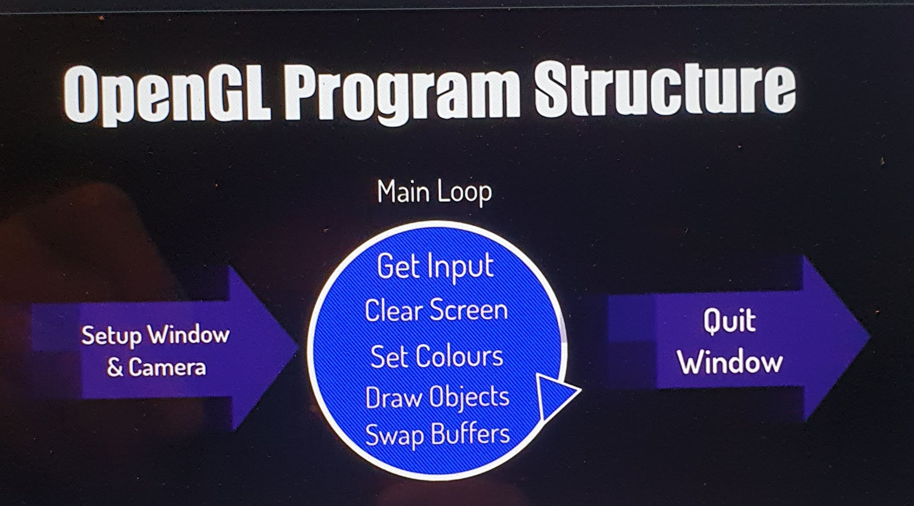

# Compare pygame and OpenGL
Here is how to draw a rectangle in pygame
~~~py
pygame.draw.rect(screen, green, 10, 10, 100, 50)
~~~

and here is how to draw it wth OpenGL

~~~py
glColor3f(green)
glBegin(GL_POLYGON)
  glVertex2i(10, 10)
  glVertex2i(10, 50)
  glVertex2i(100, 50)
  glVertex2i(100, 10)
glEnd()
~~~

